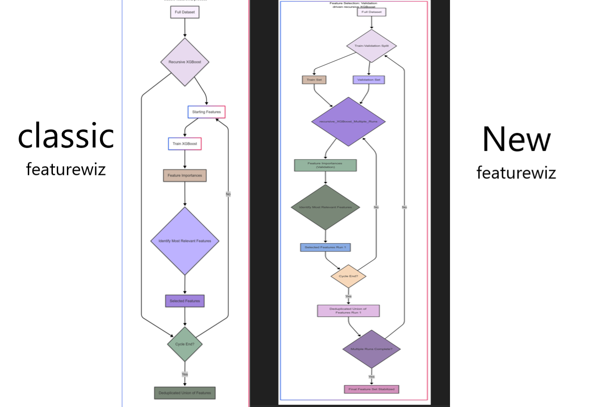

<h1>featurewiz-polars: Efficient Feature Selection and Encoding for Polars DataFrames</h1>

<h2>Project Description</h2>

<p>Supercharge your data pipelines with <b>featurewiz-polars</b>, a library designed for high-performance feature selection and categorical encoding specifically optimized for <b>Polars DataFrames</b>. Process massive datasets with speed and efficiency, leveraging the power of Polars for feature engineering and machine learning workflows.</p>

<h2>Motivation: Addressing Bottlenecks</h2>

<p>This library was born out of the need for <b>efficient feature engineering</b> when working with <b>large datasets</b> and the <b>Polars DataFrame library</b>. Traditional feature selection and categorical encoding methods often become computationally expensive and memory-intensive as datasets grow in size and dimensionality.</p>

<p>Specifically, the motivation stemmed from the following challenges:</p>

<ul>
    <li><b>Performance limitations with large datasets:</b> Existing feature selection and encoding implementations (often in scikit-learn or Pandas-based libraries) can be slow and inefficient when applied to datasets with millions of rows and hundreds of columns.</li>
    <li><b>Lack of Polars integration:</b> Many feature engineering tools are designed for Pandas DataFrames, requiring conversions to and from Polars, which introduces overhead and negates the performance benefits of Polars.</li>
    <li><b>Need for efficient MRMR feature selection:</b> Max-Relevance and Min-Redundancy (MRMR) is a powerful feature selection technique, but efficient implementations optimized for large datasets were needed, especially within the Polars ecosystem.</li>
    <li><b>Handling diverse data types:</b> The library needed to seamlessly handle both numerical and categorical features, and intelligently apply appropriate mutual information estimators for redundancy calculations.</li>
    <li><b>Extensibility and Pipeline Integration:</b> The components should be designed as scikit-learn compatible transformers, allowing for easy integration into machine learning pipelines and workflows.</li>
</ul>

<h2>Key Differentiators</h2>

The new featurewiz-polars leveraging the Polars library delivers the following **advantages over the current `classic featurewiz` library:**

1.  **Improved Generalization and Reduced Overfitting (with Performance Boost):** The new library features a new feature selection approach that directly addresses the risk of overfitting by splitting the data into train and validation for faster iteration and evaluation of different feature subsets, leading to a more robust and generalizable feature selection. Polars' speed allows you to experiment more extensively with different validation splits and hyperparameter settings, further minimizing overfitting.

2.  **Stabilized Feature Selection (with Faster Iterations):** By performing multiple runs with different train/validation splits, this new approach reduces the variance and instability inherent in single-run feature selection processes. Polars' performance enables you to complete these multiple runs much faster than with Pandas, making the stabilization process more practical and less time-consuming.

3.  **Efficient Data Handling for Large Datasets (Polars' Core Strength):** Polars is designed for high-performance data manipulation, especially on large datasets. This is a significant advantage when performing recursive feature selection, which involves repeatedly subsetting and transforming the data. Polars' optimized query engine and memory management make the process much faster and more efficient.

4.  **Seamless Integration with XGBoost:** Polars integrates well with XGBoost. You can efficiently load data into Polars dataframes, perform feature selection using Polars, and then directly feed the selected features into an XGBoost model directly using Polars for training. This streamlined workflow simplifies the entire machine learning pipeline.

In short, using Polars with our train-split-validation-driven `recursive_xgboost` method offers a powerful combination: the robust feature selection benefits of the validation approach coupled with Polars' speed, efficiency, and seamless integration with XGBoost. This results in a more reliable and faster feature selection process, particularly for large datasets.

<h2>Development stages: From request to algorithm</h2>

<p>The development of <code>featurewiz-polars</code> was an iterative process driven by the initial request for improved feature engineering and evolved through several key stages:</p>

<ol>
    <li><b>Initial Request & Problem Definition:</b> My journey began with a user request to bring featurewiz's amazing feature selection and encoding capabilities to Polars, particularly for large datasets. The core problem they faced was the inefficiency of existing methods which cannot scale with pandas to millions of rows.</li>
    <li><b>Focus on Polars Efficiency:</b> I then made the decision to build the library natively using Polars DataFrames to leverage Polars' blazing speed and memory efficiency. This meant re-implementing my entire feature engineering pipeline using native Polars operations as much as possible. This was much harder than I imagined.</li>
    <li><b><code>Polars_CategoricalEncoder</code> Development:</b> The first step was to create a fast categorical encoder for Polars. <code>Polars_CategoricalEncoder</code> was conceived and developed, by refining my original featurewiz implementation called My_Label_Encoder(), by adding more encoding types (Target, WOE, Ordinal, One-Hot), and I then finally added handling of nan's and null values in those categories (Wooh).</li>
    <li><b><code>Polars_DateTimeEncoder</code> Development:</b> The next step was to create a fast date-time encoder for Polars. <code>Polars_DateTimeEncoder</code> was developed, again added some error handling in dates.</li>
    <li><b><code>Other Transformers</code> Development:</b> The final step was to create a Y-Transformer that can encode target variables that are categorical for Polars. <code>The YTransformer</code> was developed and it turned out to be very useful in scikit-learn pipelines which I later developed (see below) .</li>
    <li><b><code>Polars_SULOV_MRMR</code> Development & Iteration:</b> The core of the library, the <code>Polars_SULOV_MRMR</code>, underwent several iterations to optimize performance and correctness:
        <ul>
            <li><b><code>V1-V3</code>:</b> Initially I focused on creating a basic Polars-compatible MRMR selector, copying my featurewiz implementation and modifying it to Polars.</li>
            <li><b><code>V4</code>:</b> I then made a critical correction to the calculations in <code>recursive_xgboost</code> process to address the growing volume of features it selected that did not add to performance.</li>
            <li><b><code>V5</code>:</b> I found a major stumbling block in that classic process and corrected it in <code>V5</code>. This involved splitting the dataset into train and validation and running recursive_xgboost within it, thus  ensuring a stable number of features in each round of XGBoost feature selection. I have renamed the old approach as "classic" and the new approach as "split-driven" which you can test in the library.</li>
        </ul>
    </li>
    <li><b>Pipeline Examples & Testing:</b> Pipeline examples (e.g., <code>fs_test.py</code> and <code>featurewiz_polars_test1.ipynb</code>) were created to test the integration of the encoder and selector within scikit-learn pipelines and to test the functionality and performance of the library.</li>
    <li><b>Addressing Date-Time Variables:</b> The library's scope was expanded to include date-time variables (to help in time series tasks) and the filling of NaN's and Nulls in Polars data frames. Thus a <code>Polars_MissingTransformer</code> was  added to handle Nulls and NaNs efficiently within Polars.</li>
    <li><b>Testing and Refinement:</b> Throughout the development, I put in an intense focus on verifying the correctness of the new algorithms and code, making sure that the new algorithm outpeformed my existing classic featurewiz library, particularly in the <code>recursive_xgboost</code> method which I modified.</li>
</ol>

<h2> Install</h2>

This library is not available on pypi yet. You need to clone the library from source as follows:

```
cd <new_folder_Destination>
git clone https://github.com/AutoViML/featurewiz_polars.git
pip install -r requirements.txt
cd examples
python fs_test.py
```

or download and unzip https://github.com/AutoViML/featurewiz_polars/archive/master.zip

or you can install from source as follows:

```
pip install git+https://github.com/AutoViML/featurewiz_polars.git
```

<h2>featurewiz-polars in Pipelines</h2>

<p>I have given you some example pipeline scripts (e.g., <code>fs_test.py</code> and <code>fs_comparison_test.py</code>) for learning to use <code>featurewiz-polars</code> library in a machine learning pipeline. In addition, these examples showcase the difference between this library and the classic featurewiz library as well as with other competing mRMR libraries. Specifically, I show you how to:</p>
<ul>
    <li>Load data into Polars DataFrames using:</li> 
    <code>df = pl.read_csv(datapath+filename, null_values=['NULL','NA'], try_parse_dates=True, infer_schema_length=10000, ignore_errors=True)</code>
    <li>Split the Polars dataframe into train and test using scikit-learn's train_test_split using:</li> 
    <code>
        X = df[predictors] <br>
        y = df[target] <br>
        X_train, X_test, y_train, y_test = train_test_split(X, y, test_size=0.2, random_state=42)<br></code>
    <li>Call <code>Featurewiz_MRMR</code> for doing feature selection as well as training a model simultaneously.</li>
    <code>
    mrmr = Featurewiz_MRMR(model_type="Regression", <br>
                corr_threshold=0.7, encoding_type='onehot', classic=True, verbose=1) <br>
    </code>
    <li>Call <code>Featurewiz_MRMR_Model</code> for doing feature selection as well as training a model simultaneously.</li>
    mrmr_model = Featurewiz_MRMR_Model(model_type="Regression", model=XGBRegressor(),<br>
                corr_threshold=0.7, encoding_type='onehot', classic=True, verbose=1) <br>
</ul>

<h2>Old Method vs. New Method</h2>

**Select either the old featurewiz method or the new method** using the `classic` argument in the new library: (e.g., if you set `classic`=True, you will get features similar to the old feature selection method). If you set it to False, you will use the new feature selection method. I would suggest you try both methods to see which set of features works well for your dataset.<br>



The new featurewiz-polars library uses an improved method for recursive XGboost feature selection known as Split-Driven Recursive_XGBoost: In this method, we use Polars under the hood to speed up calculations for large datasets and in addition perform the following steps:
1.	**Split Data for Validation**: Divide the dataset into separate training and validation sets. The training set is used to build the XGBoost model, and the validation set is used to evaluate how well the selected features generalize to unseen data.
2.	**XGBoost Feature Ranking (with Validation)**: Within each run, use the training set to train an XGBoost model and evaluate feature importance. Assess the performance of selected features on the validation set to ensure they generalize well.
3.	**Select Key Features (with Validation)**: Determine the most significant features based on their importance scores and validation performance.
4.	**Repeat with New Split**: After each run of the recursive_xgboost cycle is complete, repeat the entire process (splitting, ranking, selecting) with a new train/validation split.
5.	**Final, Stabilized Feature Set**: After multiple runs with different splits, combine the selected features from all runs, removing duplicates. This results in a more stable and reliable final feature set, as it's less sensitive to the specific training/validation split used.

<h2>Benefits of using featurewiz-polars</h2>
<ul>
    <li><b>Significant Performance Gains:</b> Leverage Polars' speed and efficiency for feature engineering on large datasets.</li>
    <li><b>Simplified Polars Workflows:</b> Work directly with Polars DataFrames throughout your feature engineering and machine learning pipelines, avoiding unnecessary data conversions.</li>
    <li><b>Robust Feature Selection:</b> Benefit from the power of MRMR feature selection, optimized for Polars and corrected for accurate redundancy calculation across mixed data types.</li>
    <li><b>Flexible Categorical Encoding:</b> Choose from various encoding schemes (Target, WOE, Ordinal, OneHot Encoding)</li>
</ul>
